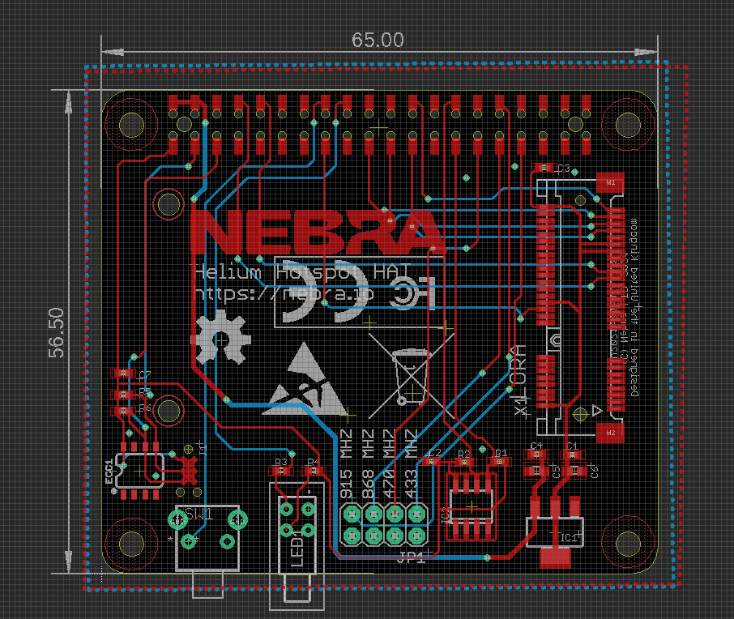

# Nebra Helium Hotspot Hat

The Nebra Helium Hotspot HAT is designed for the new generation of Nebra Helium Hotspots.

It features space for the Radio Module, a button & two LEDs. Along with an EEPROM to store RPi HAT data and a ATECC to comply with Helium Hotspot Requirements.

# DIY Note

Please note, while you are able to build a DIY option of this board it will not earn HNT unless the ECC is programmed by an authorised Helium Maker.
