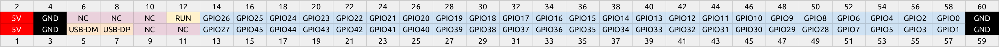

# Nebra Smart Daughterboard CM3
Hardware Files for the CM3 daughterboard for the Nebra Smart Hotspots

This board is used to provide the support circuitry for the CM3/CM3+, and breaks out the GPIO pins along with USB to a 60 Pin Header.

# Daughterboard Connector Pinout
The Daughterboard connector is of our own specification, it allows us in the future to create new daughterboards for other SBCs.

The electrical pinout is as follows:

